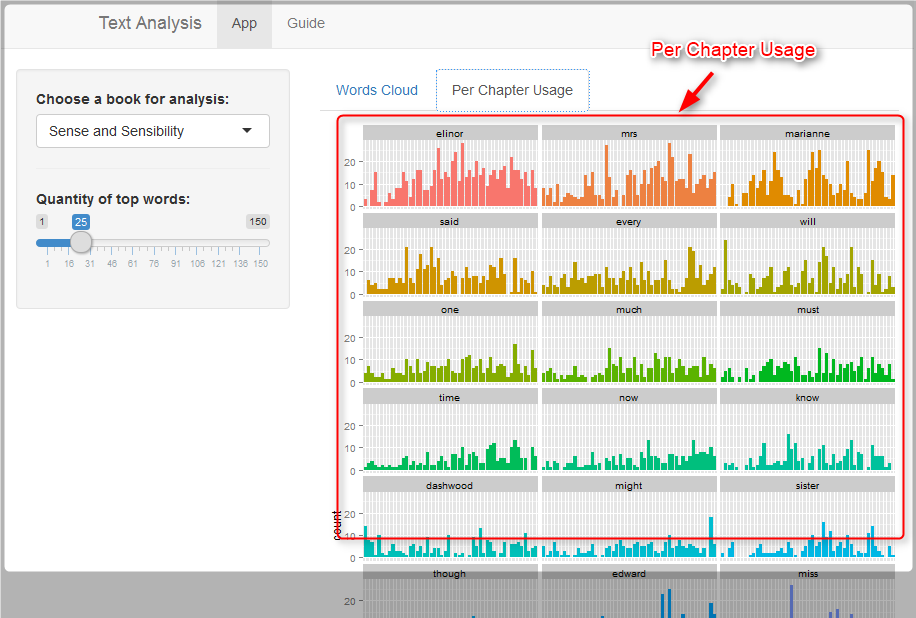

# User Guide

The app is based on the work of **Fereshteh Karimeddini** [Word Cloud][1]. In the other hand it was also inspired by the book of **Matthew L. Jockers** [Text Analysis with R for Students of Literature][2] about how to use the data analysis in the literature science.

## What can be done

So, this app allows to make brief analysis of the two literature works:
- Sense and Sensibility by Jane Austen;
- Moby Dick; or The Whale by Herman Melville.

## How to use the app

The app is made to be extremely easy to use. I reduced the quantity of input options to make user feel happy with the play.
You may choose the book for analysis and select the quantity of top used words you need. These words will be used to build **Words Cloud**. They also used to prepare per word per chapter usage bar plot. This might be interesting for literature scientists.

### Settings sidebar

First of all you need just choose a book as displayed on the image below.
Please use **Choose a book for analysis** option to do that.

You may also change the quantity of top used words. It will be used to prepare Words Cloud and per chapter usage plots for each of words.

### Plot tabs

In the report area please use Tabs to choose the chart you want to display. You have two options:
- Words Cloud
- Per Chapter Usage

#### Word Cloud

**Words Cloud** will display top used words in the form of cloud, that pretty combined by [wordcloud][3] package.

#### Per chapter usage

**Per Chapter Usaged** will display per chapter usage bar plot for each of top word you selected.

## Conclusion

This is just a study app, but you may find my tool useful and enhance it. Feel free to fork. There's the [GitHub][4] page of the app.

Thank you for reading.

  [1]: http://shiny.rstudio.com/gallery/word-cloud.html "Word Cloud"
  [2]: https://www.springer.com/us/book/9783319031637#aboutBook "Text Analysis with R for Students of Literature"
  [3]: http://www.inside-r.org/packages/cran/wordcloud/docs/wordcloud "wordcloud {wordcloud}"
  [4]: https://github.com/riversy/DevelopingDataProducts_CourseProject "Course Project on Developing Data Products"
