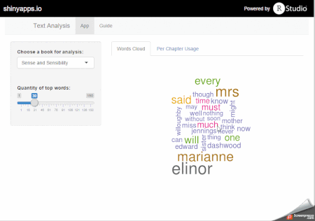
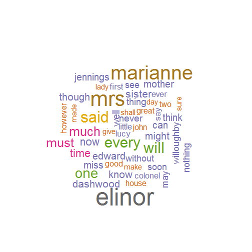
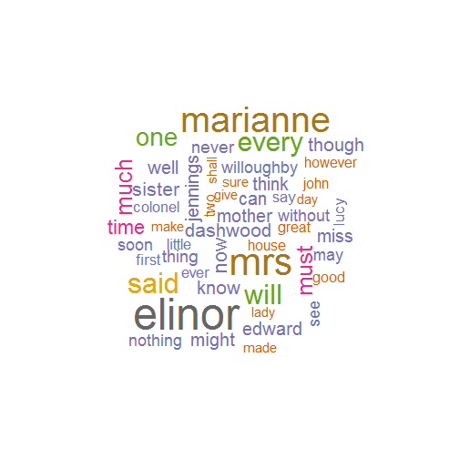
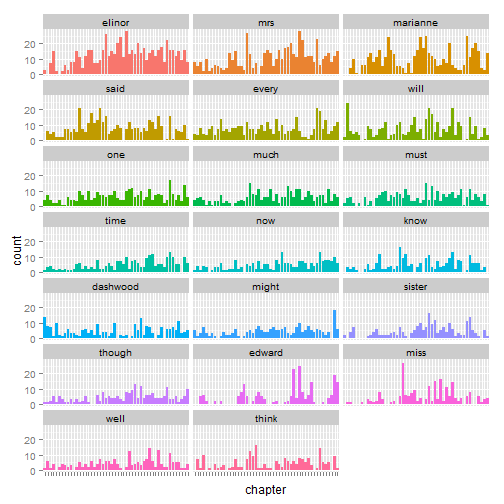

## The idea

The app is based on the work of **Fereshteh Karimeddini** [Words Cloud][1]. In the other hand it was also inspired by the book of **Matthew L. Jockers** [Text Analysis with R for Students of Literature][2] about how to use data analysis in the literature science. My idea was to combine few methods of visualization of text data together and test it on sample books.

This app allows to make brief analysis of two literature works:
- Sense and Sensibility *by Jane Austen*;
- Moby Dick; or The Whale *by Herman Melville*.

User may choose the book for analysis and select the quantity of top used words you need. These words will be used to build **Words Cloud**. App will also build **Per Chapter Usage** bar plot for each of these words. This might be interesting for literature scientists to get in how author used words across the novel.


  [1]: http://shiny.rstudio.com/gallery/word-cloud.html "Words Cloud"
  [2]: https://www.springer.com/us/book/9783319031637#aboutBook "Text Analysis with R for Students of Literature"


---
## The app



It available by link - [https://goo.gl/5l8HKi][1].

  [1]: https://goo.gl/5l8HKi "Text Analysis App"

---

## Words Cloud Code

The link to code that builds matrix is placed here - [https://goo.gl/seRxQp](https://goo.gl/seRxQp)


```r
bookTerms <- getTermMatrixPerBook('austen', 50)
wordcloud(
  names(bookTerms),
  bookTerms,
  scale=c(4, 0.5),
  min.freq = 1,
  max.words=50,
  colors=brewer.pal(
    8,
    "Dark2"
  )
)
```

 

---

## Words Cloud Plot

 

---

## Per Chapter Usage Code

The link to the code that used to prepare data for Per Chapter Usage is also here - [https://goo.gl/seRxQp](https://goo.gl/seRxQp)


```r
df <- getPerChapterDataFrame('austen', 20)
ggplot(
  df,
  aes(
    x=chapter,
    y=count,
    fill=word)
  ) +
  geom_bar(stat="identity")  +
  facet_wrap( ~ word, ncol = 3) +
  theme(
    axis.text.x=element_blank(),
    legend.position="none"
  )
```

 

---

## Per Chapter Usage Plot

 

---

## Conclusion

The app may tested here - [https://goo.gl/5l8HKi](https://goo.gl/5l8HKi).

You may enhance the code if you found it useful.
Just fork it here - [https://goo.gl/q7CplV](https://goo.gl/q7CplV).

Thank you.
